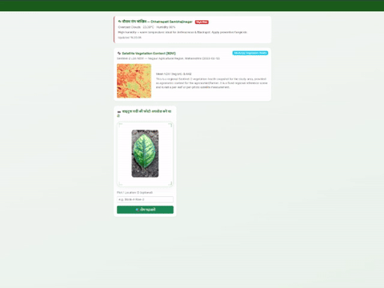

# 🍋 Citrus Disease Detector V2

ResNet-50 fusion model (9 classes) wrapped in a Flask app.
Features: **Grad-CAM · Severity · Treatment Cards · PDF Report · Prediction History · Mobile Camera · Weather Risk Alerts · Multilingual (EN / हिं / मर)**

### 🔗 [**Live Demo →**](https://sanketd11-citrus-disease-detector.hf.space)

Upload or snap a photo of a citrus leaf and get an instant disease diagnosis with a Grad-CAM explainability heatmap, severity rating, treatment recommendations, and a downloadable PDF report — all in your browser, no install needed.

---
  ## Demo


## Screenshots

<!--
  Add 2-3 screenshots or a short GIF here showing the app in action.
  Suggested shots: (1) upload screen, (2) result card with Grad-CAM heatmap,
  (3) the generated PDF report. A short screen-recording GIF of the full
  upload → result flow works great too.

  Drop the image files into a /screenshots folder in the repo, then
  reference them like this:

  
  
  

-->

*(Screenshots coming soon — [try the live demo](https://sanketd11-citrus-disease-detector.hf.space) in the meantime.)*

---

## Deployments

This project is deployed in two places:

| Platform | Purpose | Config |
|---|---|---|
| **[Hugging Face Spaces](https://sanketd11-citrus-disease-detector.hf.space)** | Primary live demo (Docker SDK, 2 vCPU / 16GB free tier) | `Dockerfile` |
| **[Render](https://render.com)** | Alternative deployment option (Blueprint-based) | `render.yaml` |

Both read from the same `app.py` — pick whichever config matches your target platform. The Hugging Face Space is the one linked above and kept up to date as the live demo.

---

## Quick Start (local dev)

```bash
# 1. Clone / unzip the project
cd citrus_v2

# 2. Create a virtual environment
python -m venv venv
source venv/bin/activate          # Windows: venv\Scripts\activate

# 3. Install dependencies
pip install -r requirements.txt

# 4. Set environment variables (optional — weather feature requires key)
cp .env.example .env
# Edit .env and add your OpenWeatherMap API key

# 5. Run
python app.py
# Open http://localhost:5000
```

---

## Project Structure

```
citrus_v2/
├── app.py                          # Flask app — all logic here
├── results/
│   └── fusion_resnet50_v2_seed42.pth   # Trained model weights
├── requirements.txt
├── render.yaml                     # Render Blueprint config
├── Dockerfile                      # Hugging Face Spaces config
├── .env.example
├── templates/
│   ├── index.html                  # Main upload + result UI
│   └── history.html                # Prediction history + chart
├── static/
│   └── uploads/                    # Saved leaf images (auto-created)
└── instance/
    └── predictions.db              # SQLite DB (auto-created on first run)
```

---

## Production Deployment (Gunicorn + Nginx)

```bash
# Gunicorn
gunicorn -w 2 -b 0.0.0.0:5000 app:app

# Nginx proxy config (snippet)
location / {
    proxy_pass http://127.0.0.1:5000;
    proxy_set_header Host $host;
    client_max_body_size 10M;
}
```

> **Note:** `-w 2` keeps model memory manageable. Each worker loads the model once via `@lru_cache`.

---

## Deploy to Render (free tier)

1. Push this folder to a GitHub repo (Git LFS tracks the `.pth` file).
2. New Web Service → connect repo → Render auto-reads `render.yaml`.
3. Add env var `OPENWEATHER_API_KEY` in the Render dashboard.

> **Note:** Render's free tier has an ephemeral disk — the SQLite prediction history and saved leaf photos reset on every redeploy/restart. Fine for demos; migrate to a persistent disk or external DB for production use.

---

## Deploy to Hugging Face Spaces

1. Create a new Space → SDK: **Docker**.
2. Push this repo (including the `Dockerfile`) to the Space's git remote.
3. Add `OPENWEATHER_API_KEY` as a Space secret (Settings → Repository secrets).

---

## Deploy to Railway / Fly.io

Add a `Procfile`:
```
web: gunicorn -w 2 -b 0.0.0.0:$PORT app:app
```

---

## API Endpoints

| Method | Route | Description |
|--------|-------|-------------|
| GET | `/` | Main UI |
| POST | `/predict` | Upload image → JSON result |
| GET | `/report` | Download PDF report |
| GET | `/history` | Prediction history page |
| GET | `/history/data` | Disease distribution JSON |
| GET | `/set_lang/<en\|hi\|mr>` | Switch language |

### `/predict` Response Shape

```json
{
  "disease": "Citrus_Canker",
  "display": "Citrus Canker",
  "confidence": "97.3%",
  "confidence_raw": 0.973,
  "severity": "Severe",
  "sev_class": "danger",
  "cam_image": "<base64 PNG>",
  "top3": [
    {"name": "Citrus Canker", "prob": "97.3%"},
    {"name": "Citrus Blackspot", "prob": "1.8%"},
    {"name": "Anthracnose", "prob": "0.5%"}
  ],
  "treatment": {
    "cause": "...",
    "pesticide": "...",
    "prevention": "...",
    "recovery": "..."
  },
  "timestamp": "2025-06-29 14:32:01",
  "plot_id": "Block-A Row-3"
}
```

---

## Model Details

| Property | Value |
|----------|-------|
| Architecture | ResNet-50 |
| Classes | 9 |
| Input size | 224 × 224 |
| Weights file | `fusion_resnet50_v2_seed42.pth` |
| Normalisation | ImageNet mean/std |

**Classes:** Anthracnose · Citrus_Blackspot · Citrus_Canker · Citrus_Greening_HLB · Citrus_Leafminer · Citrus_Nutrient_Deficiency · Healthy_Leaf · Multiple_Diseases · Young_Healthy_Leaf

---

## Environment Variables

| Variable | Default | Description |
|----------|---------|--------------|
| `OPENWEATHER_API_KEY` | *(empty)* | Weather risk feature (free tier API key) |
| `DEFAULT_CITY` | `Chhatrapati Sambhajinagar` | City for weather lookup |
| `SECRET_KEY` | auto-generated | Flask session key — set via platform env vars, never hardcode in production |

---

## Notes

- The `.pth` file is ~94 MB. Tracked with Git LFS.
- `static/uploads/` grows over time — add a cron job to prune old images.
- SQLite is fine for a single-server deployment; migrate to PostgreSQL for multi-instance.

---

## License

Proprietary — see [LICENSE](LICENSE) for full terms.
